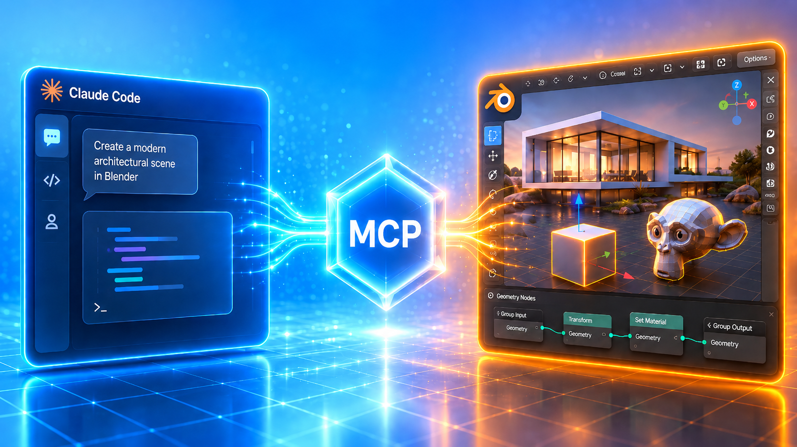

简体中文 | [English](../README.md)

# Blender MCP Skills Toolkit（中文版）



本仓库同时提供两部分内容：

1. **官方 Blender MCP 安装教程**（本地/远端）
2. **与教程配套的 skill 包**（`blender-mcp-skills`，含模板与开发指导）

目标是先安装打通，再稳定复用 extension 开发流程，并持续扩展更多能力。

## 给 Agent 的一句话安装 Blender 官方 MCP 的提示词

```text
请严格按 https://raw.githubusercontent.com/psiQAQ/blender_mcp-setup-guide/main/docs/blender_mcp-setup_zh.md 完成官方 Blender MCP 安装（Blender Add-on + blender-mcp server），并在 Claude Code 中完成注册与连通性验证。
```

## Skills 能力（简述）

`blender-mcp-skills` 主要覆盖：

- Blender 4.2+ extension-only 脚手架流程
- autoload 拓扑注册与 `operators/panels/utils` 结构拆分
- 校验/构建脚本实践（`validate_extension.py`、`build_extension.py`）
- 跨系统运行适配提示（WSL/Linux/Windows 路径策略）

## 教程入口

- 本地单机教程（中文）：[`blender_mcp-setup_zh.md`](./blender_mcp-setup_zh.md)
- 本地单机教程（English）：[`blender_mcp-setup_en.md`](./blender_mcp-setup_en.md)
- 远端局域网教程（中文）：[`blender_mcp-remote_zh.md`](./blender_mcp-remote_zh.md)
- 远端局域网教程（English）：[`blender_mcp-remote.md`](./blender_mcp-remote.md)

## Skills 安装

- 本仓库技能路径：`./.claude/skills/blender-mcp-skills/`
- 技能名：`blender-mcp-skills`

```bash
npx skills add ./.claude/skills/blender-mcp-skills
```

## 目录结构（按 skill 展开）

```text
blender_mcp/
├─ README.md                                # 根目录英文总览
├─ LICENSE
├─ assets/
│  └─ imgs/
├─ docs/
│  ├─ README_zh.md                          # 本文件（中文总览）
│  ├─ blender_mcp-setup_zh.md               # 本地教程（中文）
│  ├─ blender_mcp-setup_en.md               # 本地教程（英文）
│  ├─ blender_mcp-remote_zh.md              # 远端教程（中文）
│  └─ blender_mcp-remote.md                 # 远端教程（英文）
├─ .claude/skills/blender-mcp-skills/
│  ├─ SKILL.md                              # 技能入口
│  ├─ references/                           # 开发思路与规范指导
│  │  ├─ index.md / template-guide.md
│  │  ├─ extension-workflow.md / extension-install.md / lifecycle.md
│  │  ├─ system-adaptation.md / pitfalls-and-fixes.md
│  │  └─ migration-notes.md / manifest-fields.md
│  └─ templates/extension_addon/
│     ├─ operators/ panels/ utils/
│     └─ scripts/
└─ submodules/                              # 外部参考项目（git submodule）
```

## 触发示例（给 Claude）

- “按教程帮我安装官方 Blender MCP，并验证连接。”
- “我想做一个 Blender 插件（用途是 XXX），请用 `blender-mcp-skills` 帮我完成开发并产出可发布版本。”
- “把这个旧插件升级到 Blender 4.2+ extension 结构，并按推荐流程完成验证与打包。”

## TODO（后续能力）

- 增加按复杂度分层的模板
- 增加更严格的自动化校验流程
- 补充 legacy 到 extension 的迁移案例库
- 增加常见任务的一句话提示词集合

## 鸣谢

感谢以下开源项目提供实践与参考：

- `clean-blender-addon-template`
- `blender-addon-template`
- `BlenderAddonPackageTool`
- `blender_vscode`
- `AdvancedBlenderAddon`
- `blender-extension-template`
- `BlenderTemplate`

## 开源许可

本仓库默认采用 **GNU GPL v2**（见 [`../LICENSE`](../LICENSE)）。
