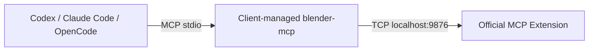

[简体中文](./blender_mcp-stdio-setup_zh.md) | English

# Install official Blender Lab MCP over stdio

This method targets the original Extension's supported platforms and requires **Blender 5.1+**, with the MCP client and Blender in the same operating-system environment on one computer. Install the official Blender Extension and external Python MCP tool separately; the client manages the `blender-mcp` stdio process.

For a Windows package with bundled dependencies and copied HTTP settings, use the [integrated Extension guide](blender_mcp-setup_en.md). The [README](../README.md) compares both methods.



## 1. Install and start the official Blender Extension

1. Install Blender 5.1+ from [blender.org](https://www.blender.org/download/).
2. Obtain the Extension from the [Blender Lab MCP page](https://www.blender.org/lab/mcp-server/). Follow its repository installation flow, or download its ZIP and use **Edit → Preferences → Add-ons → top-right menu → Install from Disk**.
3. Enable and expand the official **MCP** Extension. Enable **Preferences → System → Network → Allow Online Access**, required by the pinned v1.0.3 bridge.
4. Keep **Host = localhost**, **Port = 9876**, click **Start MCP Bridge Server**, and check for **Server is running**. **Auto Start** is also available.

Stop and disable **Blender MCP Integrated** first if installed; both bridges cannot use the same port. The tool below is pinned to official v1.0.3. Check compatibility before using another official Extension version.

## 2. Install the external MCP tool

Prepare [Git](https://git-scm.com/downloads), [uv](https://docs.astral.sh/uv/getting-started/installation/) and your client: [Codex](https://developers.openai.com/codex/), [Claude Code](https://code.claude.com/docs/en/setup) or [OpenCode](https://opencode.ai/docs/).

Check in a new terminal:

```text
git --version
uv --version
```

Install into uv's isolated tool environment. The source and commit are pinned. Python 3.11 is selected; the tool requires 3.10+. uv can download managed Python if needed, and installation requires network access.

**Windows PowerShell:**

```powershell
$blenderSource = 'git+https://projects.blender.org/lab/blender_mcp.git@2cea8d566dde07fbac28a61d698909d69724e853#subdirectory=mcp'
uv tool install --python 3.11 $blenderSource
blender-mcp --help
Get-Command blender-mcp
```

**macOS / Linux, Bash or Zsh:**

```bash
blender_source='git+https://projects.blender.org/lab/blender_mcp.git@2cea8d566dde07fbac28a61d698909d69724e853#subdirectory=mcp'
uv tool install --python 3.11 "$blender_source"
blender-mcp --help
command -v blender-mcp
```

`--help` checks the executable without connecting to Blender. The client starts the stdio server; no persistent manual terminal server is needed.

If the executable is missing from PATH, inspect `uv tool dir --bin`, use `uv tool update-shell`, then reopen the terminal and GUI client. Alternatively, configure the discovered executable's absolute path. Do not assume `%USERPROFILE%` or `~` expands inside a client's `command` field.

## 3. Configure your client

These settings correspond to **persistent `uv tool install`** in section 2. Complete your client's subsection, merge existing settings and preserve other entries. Replace the old `blender` entry when switching methods, including any duplicate scope.

### 3.1 Codex

User settings: `%USERPROFILE%\.codex\config.toml` on Windows, `~/.codex/config.toml` on macOS / Linux. Trusted projects can use `.codex/config.toml`. Create missing directories/files and add:

```toml
[mcp_servers.blender]
enabled = true
command = "blender-mcp"
args = []

[mcp_servers.blender.env]
BLENDER_MCP_HOST = "localhost"
BLENDER_MCP_PORT = "9876"
```

Alternatively, register a user entry with the CLI. Choose file editing or CLI registration. These commands work in PowerShell and Bash:

```text
codex mcp add blender --env BLENDER_MCP_HOST=localhost --env BLENDER_MCP_PORT=9876 -- blender-mcp
codex mcp list
codex mcp get blender
```

Restart the session or reload MCP settings, then verify a scene call in section 4. See [official OpenAI MCP documentation](https://developers.openai.com/codex/mcp/).

### 3.2 Claude Code

**User configuration**: register in `~/.claude.json` across projects with this PowerShell/Bash command. Everything after `--` is the server command:

```text
claude mcp add --transport stdio --scope user blender --env BLENDER_MCP_HOST=localhost --env BLENDER_MCP_PORT=9876 -- blender-mcp
```

**Project configuration**: alternatively, create or merge `.mcp.json` at the project root. Avoid also registering the same user entry:

```json
{
  "mcpServers": {
    "blender": {
      "type": "stdio",
      "command": "blender-mcp",
      "args": [],
      "env": {
        "BLENDER_MCP_HOST": "localhost",
        "BLENDER_MCP_PORT": "9876"
      }
    }
  }
}
```

Check from that project and start a new session:

```text
claude mcp list
claude mcp get blender
claude
```

Approve project configuration when prompted, inspect `/mcp`, then perform section 4. See [Claude Code's official MCP documentation](https://code.claude.com/docs/en/mcp).

### 3.3 OpenCode

User settings: `%USERPROFILE%\.config\opencode\opencode.json` on Windows, `~/.config/opencode/opencode.json` on macOS / Linux. A project-root `opencode.json` is also supported. Create missing directories/files and merge:

```json
{
  "$schema": "https://opencode.ai/config.json",
  "mcp": {
    "blender": {
      "type": "local",
      "command": ["blender-mcp"],
      "enabled": true,
      "environment": {
        "BLENDER_MCP_HOST": "localhost",
        "BLENDER_MCP_PORT": "9876"
      }
    }
  }
}
```

Save, restart OpenCode and inspect from the relevant project:

```text
opencode mcp list
```

Then read the scene using section 4. `command` is the complete command array; environment variables use `environment`. See [configuration locations](https://opencode.ai/docs/config/) and [MCP fields](https://opencode.ai/docs/mcp-servers/).

## 4. Verify communication and diagnose errors

Keep Blender open with **Server is running**. Start with:

> Use blender MCP to read Blender's version and current scene objects. Report the actual returned data.

For a write check, use a backed-up scene: create `MCP_Test_Cube`, read its position, remove that test object and confirm the original object count. MCP initialization can succeed before the Blender bridge connects; verify the actual scene result.

| Symptom | Check or action |
| --- | --- |
| command not found / cannot spawn | Run `blender-mcp --help` in the client's environment; check PATH or use the executable's absolute path |
| Connected but Cannot connect to Blender | Bridge running, online access enabled, matching Host/Port and `BLENDER_MCP_HOST` / `BLENDER_MCP_PORT` |
| blender entry not loaded | Actual file, user/project scope, client restart and project trust |
| Wrong Blender instance | Assign separate bridge ports and update each client's environment |
| Windows GUI client cannot find the tool | Restart it after installation to refresh PATH; verify installation in Windows |
| WSL/container/SSH connection failure | `localhost` belongs to the client's operating environment; cross-system networking needs separate configuration |

Windows executable paths in JSON need escaped backslashes, e.g. `"C:\\Users\\Alice\\.local\\bin\\blender-mcp.exe"`. TOML can use a literal string, e.g. `command = 'C:\Users\Alice\.local\bin\blender-mcp.exe'`. Use the actual discovered path.

## 5. Update, switch methods or uninstall

Verify a new stable official version and commit. Update and execute the appropriate source-variable assignment in section 2, then reinstall in the same terminal.

**Windows PowerShell:**

```powershell
uv tool install --reinstall --python 3.11 $blenderSource
blender-mcp --help
```

**macOS / Linux, Bash or Zsh:**

```bash
uv tool install --reinstall --python 3.11 "$blender_source"
blender-mcp --help
```

The new source must contain the verified commit SHA and `#subdirectory=mcp`. Check the official Extension version, restart the client and read the scene again. Pinning source does not lock transitive dependencies; the [integrated package](blender_mcp-setup_en.md) has a separate complete wheel lock.

Before switching to integrated HTTP, remove the client's stdio entry, stop and disable the official Extension, then follow the [integration guide](blender_mcp-setup_en.md).

- Codex: remove `[mcp_servers.blender]` and `.env` from the selected file; CLI-registered user entries can use `codex mcp remove blender`.
- Claude Code: run `claude mcp remove --scope user blender` for user scope, or remove only `mcpServers.blender` from the project file.
- OpenCode: remove only `mcp.blender` from the chosen settings file.

After closing client sessions using the tool, uninstall the persistent tool and stop, disable and uninstall the official Blender Extension:

```text
uv tool uninstall blender-mcp
```

## Appendix: use a cached uvx environment

To use uvx instead of persistent installation in section 2, keep Git, uv and the official Extension from section 1. First warm and check the pinned tool in a terminal; this command works in PowerShell and Bash:

```text
uvx --python 3.11 --from "git+https://projects.blender.org/lab/blender_mcp.git@2cea8d566dde07fbac28a61d698909d69724e853#subdirectory=mcp" blender-mcp --help
```

Replace section 3's entry with the following settings. The client needs `uvx` on PATH; initial dependency preparation needs network access. Locations, merging, scope and inspection commands are the same as section 3.

**Codex:**

```toml
[mcp_servers.blender]
enabled = true
command = "uvx"
args = ["--python", "3.11", "--from", "git+https://projects.blender.org/lab/blender_mcp.git@2cea8d566dde07fbac28a61d698909d69724e853#subdirectory=mcp", "blender-mcp"]
startup_timeout_sec = 60

[mcp_servers.blender.env]
BLENDER_MCP_HOST = "localhost"
BLENDER_MCP_PORT = "9876"
```

**Claude Code, project `.mcp.json`:**

```json
{
  "mcpServers": {
    "blender": {
      "type": "stdio",
      "command": "uvx",
      "args": ["--python", "3.11", "--from", "git+https://projects.blender.org/lab/blender_mcp.git@2cea8d566dde07fbac28a61d698909d69724e853#subdirectory=mcp", "blender-mcp"],
      "env": {
        "BLENDER_MCP_HOST": "localhost",
        "BLENDER_MCP_PORT": "9876"
      }
    }
  }
}
```

**OpenCode:**

```json
{
  "$schema": "https://opencode.ai/config.json",
  "mcp": {
    "blender": {
      "type": "local",
      "command": ["uvx", "--python", "3.11", "--from", "git+https://projects.blender.org/lab/blender_mcp.git@2cea8d566dde07fbac28a61d698909d69724e853#subdirectory=mcp", "blender-mcp"],
      "enabled": true,
      "timeout": 60000,
      "environment": {
        "BLENDER_MCP_HOST": "localhost",
        "BLENDER_MCP_PORT": "9876"
      }
    }
  }
}
```

This uses uvx's cache; uninstalling a persistent tool does not remove that cache. Update the pinned commit, warm the tool again and repeat scene verification. See [uv's official tool guide](https://docs.astral.sh/uv/guides/tools/).
