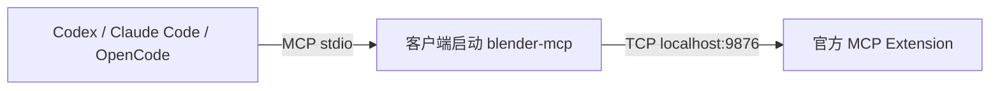

简体中文 | [English](./blender_mcp-stdio-setup_en.md)

# Blender Lab 官方 MCP：stdio 安装

适用于官方原版支持的平台，要求 **Blender 5.1+**，MCP 客户端与 Blender 在同一台电脑的同一系统环境运行。本方式分别安装官方 Blender Extension 与外部 Python MCP 工具，由客户端启动并管理 `blender-mcp` 的 stdio 进程。

如果希望使用随包依赖、复制 HTTP 配置的 Windows 方案，请改用[集成 Extension 教程](blender_mcp-setup_zh.md)。两种方式的适用情况见[仓库首页](README_zh.md)。



## 1. 安装并启动官方 Blender Extension

1. 从 [Blender 官网](https://www.blender.org/download/) 安装 Blender 5.1+。
2. 从 [Blender Lab MCP 页面](https://www.blender.org/lab/mcp-server/) 获取官方 Extension。使用页面提供的仓库安装流程，或下载 ZIP 并通过 **Edit → Preferences → Add-ons → 右上角菜单 → Install from Disk** 安装。
3. 在 Add-ons 中启用并展开官方 **MCP** Extension，启用 **Preferences → System → Network → Allow Online Access**。固定版本 v1.0.3 的原版桥接要求此设置。
4. 保持 **Host = localhost**、**Port = 9876**，点击 **Start MCP Bridge Server**，确认偏好显示 **Server is running**。也可启用 **Auto Start**。

使用原版前，停止并禁用 **Blender MCP Integrated**；两个服务不能同时使用同一桥接端口。下文固定 MCP 工具来源为官方 v1.0.3 提交；使用其他官方 Extension 版本时先核对兼容性。

## 2. 安装外部 MCP 工具

准备 [Git](https://git-scm.com/downloads)、[uv](https://docs.astral.sh/uv/getting-started/installation/) 和所用客户端。客户端安装入口：[Codex](https://developers.openai.com/codex/)、[Claude Code](https://code.claude.com/docs/en/setup)、[OpenCode](https://opencode.ai/docs/)。

在新终端中检查：

```text
git --version
uv --version
```

安装到 uv 的独立工具环境。以下命令固定官方来源与提交，Python 选择 3.11（工具本身要求 Python 3.10+）；本机缺少该解释器时 uv 可下载托管 Python，安装过程需要网络。

**Windows PowerShell：**

```powershell
$blenderSource = 'git+https://projects.blender.org/lab/blender_mcp.git@2cea8d566dde07fbac28a61d698909d69724e853#subdirectory=mcp'
uv tool install --python 3.11 $blenderSource
blender-mcp --help
Get-Command blender-mcp
```

**macOS / Linux，Bash 或 Zsh：**

```bash
blender_source='git+https://projects.blender.org/lab/blender_mcp.git@2cea8d566dde07fbac28a61d698909d69724e853#subdirectory=mcp'
uv tool install --python 3.11 "$blender_source"
blender-mcp --help
command -v blender-mcp
```

`--help` 验证命令可执行，不建立 Blender 连接。正常 stdio 进程由客户端启动；配置前无需在终端手动运行一个持续等待输入的服务。

找不到 `blender-mcp` 时，用 `uv tool dir --bin` 查看命令目录，可运行 `uv tool update-shell` 添加工具路径，再重新打开终端及 GUI 客户端。也可把查询得到的可执行文件绝对路径写入配置。不要将 `%USERPROFILE%` 或 `~` 原样写入 `command` 并假定客户端会展开它。

## 3. 配置所用客户端

下列配置对应第 2 节的 **uv tool install 持久安装**。只完成所用客户端的小节；合并已有配置，保留其他条目。切换安装方式时替换原来的 `blender` 条目，避免同名服务器在多个作用域重复注册。

### 3.1 Codex

用户配置：Windows 为 `%USERPROFILE%\.codex\config.toml`，macOS / Linux 为 `~/.codex/config.toml`。也可在受信任项目的 `.codex/config.toml` 使用项目配置。创建缺失目录/文件后添加：

```toml
[mcp_servers.blender]
enabled = true
command = "blender-mcp"
args = []

[mcp_servers.blender.env]
BLENDER_MCP_HOST = "localhost"
BLENDER_MCP_PORT = "9876"
```

也可选择用 CLI 注册用户条目，命令适用于 PowerShell、Bash；手动配置与 CLI 注册选择一种即可：

```text
codex mcp add blender --env BLENDER_MCP_HOST=localhost --env BLENDER_MCP_PORT=9876 -- blender-mcp
codex mcp list
codex mcp get blender
```

保存配置后重启会话或重新加载 MCP，按第 4 节调用场景工具。作用域与字段见 [OpenAI 官方 MCP 文档](https://developers.openai.com/codex/mcp/)。

### 3.2 Claude Code

**用户配置**：用下面一行注册到 `~/.claude.json`，对所有项目生效。适用于 PowerShell、Bash；`--` 后面是 MCP 工具命令：

```text
claude mcp add --transport stdio --scope user blender --env BLENDER_MCP_HOST=localhost --env BLENDER_MCP_PORT=9876 -- blender-mcp
```

**项目配置**：如只希望在当前项目启用，选择创建或合并项目根目录的 `.mcp.json`，不要再重复注册同名用户条目：

```json
{
  "mcpServers": {
    "blender": {
      "type": "stdio",
      "command": "blender-mcp",
      "args": [],
      "env": {
        "BLENDER_MCP_HOST": "localhost",
        "BLENDER_MCP_PORT": "9876"
      }
    }
  }
}
```

在对应项目检查并启动新会话：

```text
claude mcp list
claude mcp get blender
claude
```

项目配置首次使用时按提示批准；在会话中输入 `/mcp` 查看连接，再执行第 4 节。语法与作用域见 [Claude Code 官方文档](https://code.claude.com/docs/en/mcp)。

### 3.3 OpenCode

用户配置：Windows 为 `%USERPROFILE%\.config\opencode\opencode.json`，macOS / Linux 为 `~/.config/opencode/opencode.json`；也支持项目根目录 `opencode.json`。创建缺失目录/文件，并合并：

```json
{
  "$schema": "https://opencode.ai/config.json",
  "mcp": {
    "blender": {
      "type": "local",
      "command": ["blender-mcp"],
      "enabled": true,
      "environment": {
        "BLENDER_MCP_HOST": "localhost",
        "BLENDER_MCP_PORT": "9876"
      }
    }
  }
}
```

保存后重新启动 OpenCode，在所用项目目录执行：

```text
opencode mcp list
```

再按第 4 节读取场景。字段 `command` 是完整命令数组，环境变量字段名为 `environment`。位置与语法见 [OpenCode config](https://opencode.ai/docs/config/) 和 [MCP 文档](https://opencode.ai/docs/mcp-servers/)。

## 4. 验证实际连接与排查故障

保持 Blender 打开，官方 Extension 显示 **Server is running**。先发送只读请求：

> 请使用 blender MCP 读取 Blender 版本和当前场景对象列表，并报告实际返回结果。

需要验证写操作时，在备份过的测试场景中请求创建 `MCP_Test_Cube`、回读位置、删除该测试对象并确认对象数恢复。客户端可能已连接 MCP 工具，但桥接尚未连通；以实际场景返回为准。

| 现象 | 检查与操作 |
| --- | --- |
| command not found / 无法启动进程 | 在与客户端相同的环境执行 `blender-mcp --help`；检查 PATH，或配置实际可执行文件绝对路径 |
| MCP connected，但 Cannot connect to Blender | 官方 Extension 是否启动、在线访问是否启用、Host/Port 是否与 `BLENDER_MCP_HOST` / `BLENDER_MCP_PORT` 一致 |
| blender 条目未加载 | 检查配置文件和用户/项目作用域，重启客户端；项目配置需满足信任要求 |
| 连接指向另一个 Blender 实例 | 给各实例不同的桥接端口，并同步修改客户端环境变量 |
| Windows GUI 客户端找不到工具 | 安装后重新启动 GUI 客户端，让它取得新 PATH；核对工具确实安装在 Windows 环境 |
| WSL/容器/SSH 客户端无法连接 | `localhost` 指客户端进程所在系统；此教程按同机同系统设计，跨系统先核对网络与路径 |

JSON 中的 Windows 可执行路径使用双反斜杠，例如 `"C:\\Users\\Alice\\.local\\bin\\blender-mcp.exe"`；TOML 可用单引号字面量，例如 `command = 'C:\Users\Alice\.local\bin\blender-mcp.exe'`。以本机查询结果为准。

## 5. 更新、切换方式与卸载

更新前核对新的官方稳定版本及提交。将新的完整 Git 来源写入第 2 节对应 shell 的变量赋值语句并执行，再在同一终端重新安装。

**Windows PowerShell：**

```powershell
uv tool install --reinstall --python 3.11 $blenderSource
blender-mcp --help
```

**macOS / Linux，Bash 或 Zsh：**

```bash
uv tool install --reinstall --python 3.11 "$blender_source"
blender-mcp --help
```

新来源需包含已核对的提交 SHA 与 `#subdirectory=mcp`。同步核对官方 Extension 版本，重启客户端并重新读取场景。固定源码提交不锁定传递依赖；[集成包](blender_mcp-setup_zh.md)另有完整 wheel 锁定记录。

切换为集成 HTTP 方式前，移除当前客户端的 stdio `blender` 条目，停止并禁用官方 Extension，再按[集成教程](blender_mcp-setup_zh.md)配置。

- Codex：删除所选 `config.toml` 中的 `[mcp_servers.blender]` 及其 `.env` 子表；CLI 注册的用户条目可运行 `codex mcp remove blender`。
- Claude Code：用户注册运行 `claude mcp remove --scope user blender`；项目配置只删除 `.mcp.json` 中的 `mcpServers.blender`。
- OpenCode：只删除所选文件中的 `mcp.blender`。

退出使用该工具的客户端会话后，可卸载持久工具，并在 Blender 中停止、禁用并卸载官方 Extension：

```text
uv tool uninstall blender-mcp
```

## 附录：使用 uvx 缓存环境

如果选择由 uvx 启动，而不执行第 2 节的持久工具安装，仍需 Git、uv 和第 1 节的官方 Extension。先在终端预热并检查固定来源，命令适用于 PowerShell、Bash：

```text
uvx --python 3.11 --from "git+https://projects.blender.org/lab/blender_mcp.git@2cea8d566dde07fbac28a61d698909d69724e853#subdirectory=mcp" blender-mcp --help
```

然后用以下配置替换第 3 节的同名条目。客户端需要能找到 `uvx`；首次准备依赖需要网络。配置位置、合并方法、作用域及检查命令与第 3 节一致。

**Codex：**

```toml
[mcp_servers.blender]
enabled = true
command = "uvx"
args = ["--python", "3.11", "--from", "git+https://projects.blender.org/lab/blender_mcp.git@2cea8d566dde07fbac28a61d698909d69724e853#subdirectory=mcp", "blender-mcp"]
startup_timeout_sec = 60

[mcp_servers.blender.env]
BLENDER_MCP_HOST = "localhost"
BLENDER_MCP_PORT = "9876"
```

**Claude Code，项目 `.mcp.json`：**

```json
{
  "mcpServers": {
    "blender": {
      "type": "stdio",
      "command": "uvx",
      "args": ["--python", "3.11", "--from", "git+https://projects.blender.org/lab/blender_mcp.git@2cea8d566dde07fbac28a61d698909d69724e853#subdirectory=mcp", "blender-mcp"],
      "env": {
        "BLENDER_MCP_HOST": "localhost",
        "BLENDER_MCP_PORT": "9876"
      }
    }
  }
}
```

**OpenCode：**

```json
{
  "$schema": "https://opencode.ai/config.json",
  "mcp": {
    "blender": {
      "type": "local",
      "command": ["uvx", "--python", "3.11", "--from", "git+https://projects.blender.org/lab/blender_mcp.git@2cea8d566dde07fbac28a61d698909d69724e853#subdirectory=mcp", "blender-mcp"],
      "enabled": true,
      "timeout": 60000,
      "environment": {
        "BLENDER_MCP_HOST": "localhost",
        "BLENDER_MCP_PORT": "9876"
      }
    }
  }
}
```

此分支使用 uvx 缓存环境；卸载第 2 节的持久工具不等于清理 uvx 缓存。更新时替换配置中的固定提交并重新预热、验收。uv 的工具环境说明见[官方指南](https://docs.astral.sh/uv/guides/tools/)。
